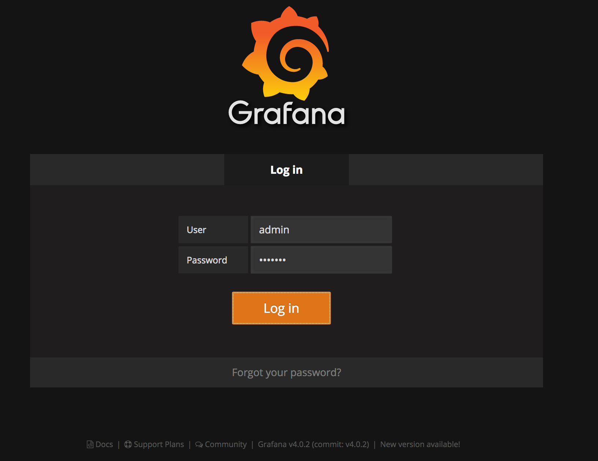
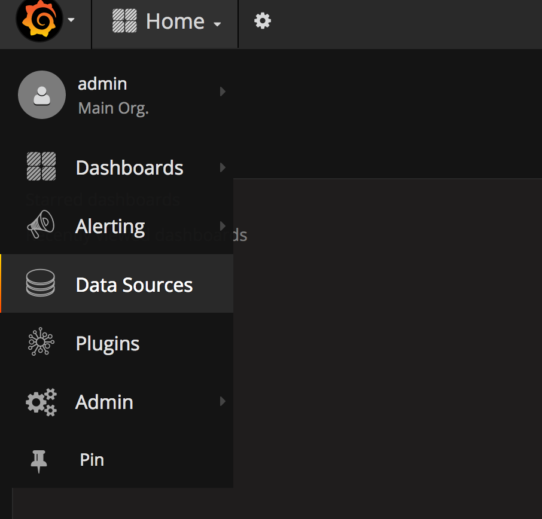
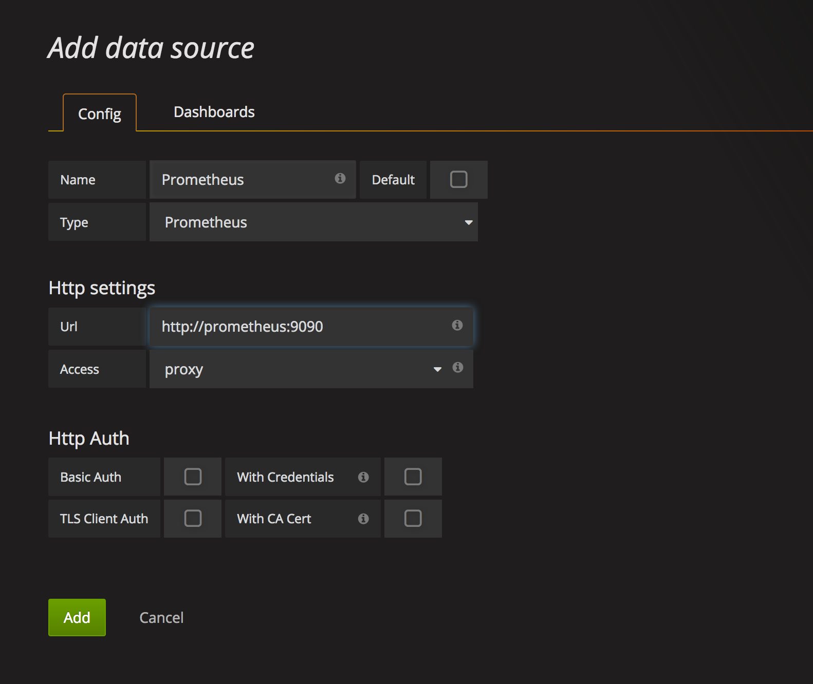
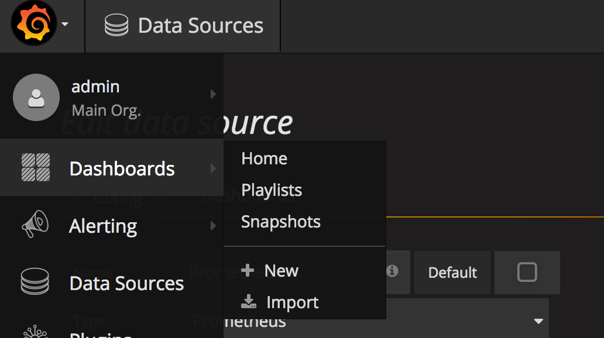
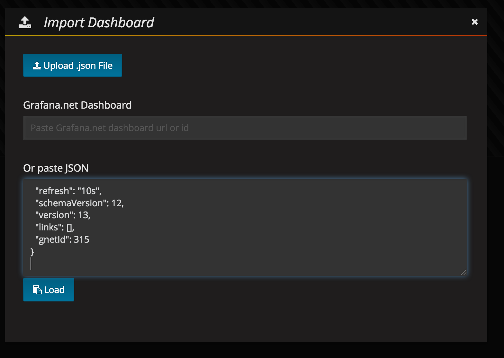
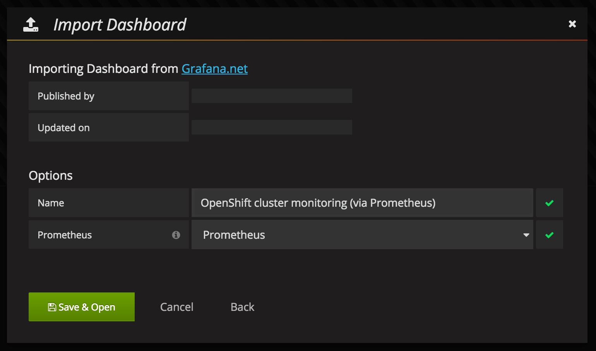
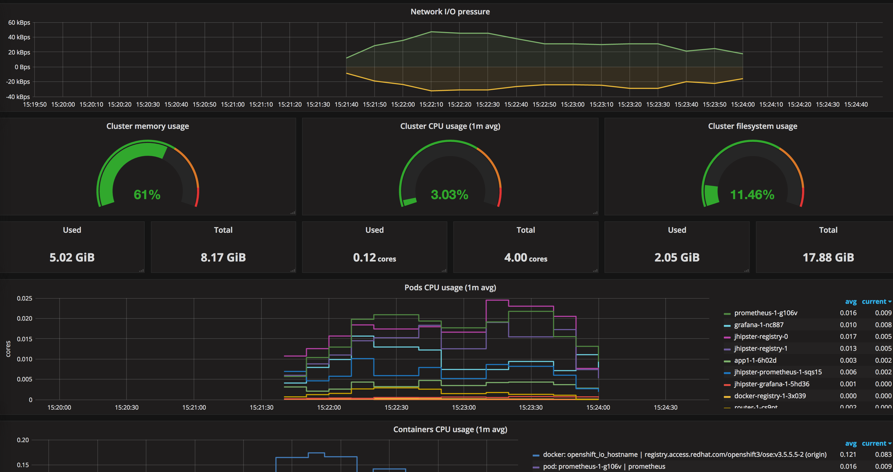

Openshift Metrics - Scrape and Visualise
----------------------------------------

Metrics scraper and visualisation tool based on prometheus and grafana for aggregating and visualising metrics from objects in OpenShift cluster

For running grafana pod, it requires some level of escalated privileges than 'default' serviceaccount. Template includes a customized serviceaccount and scc for running grafana. Credentials to login to grafana is **admin/monitor**

Grafana template is inherited from [grafana-dashboard](https://github.com/instrumentisto/grafana-dashboard-kubernetes-prometheus)

### Things to do

1. If you are running in a namespace other than 'openshift-infra', then make sure to change the following,
    **system:serviceaccount:***openshift-infra***:${SVC_ID}**
    Please change **openshift-infra** to the namespace that you are into.
2. The **monitor** service account requires access to the master server to list all available nodes and access the /metrics endpoint for each node. To do this, **monitor** service account requires the **cluster-reader** permission:
> oc adm policy add-cluster-role-to-user cluster-reader system:serviceaccount:openshift-infra:monitor

(If you have changed the namespace and service-account, then replace it appropriately)

3. Grafana pod requires escalated privileges to run. Pls configre scc with appropriate privileges.

### Data Source Configuration in Grafana
1. Login to grafana (admin/monitor)

2. Select Data Source 

3. Add Prometheus Source 

4. Import Grafana Dashboard 

5. Add Dashboard JSON either through URL/content/upload) 

6. Save Dashboard 

7. Monit O/P 
